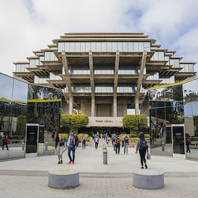
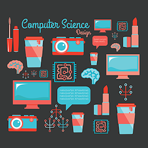

## About Me

 

First off, you can call me Sam! I am a student and healthcare worker with a passion for health, research, and human-computer interaction. 

The most important thing in my life is improving myself and the daily lives of those around me, by means of education and encouragement. 

I pride myself on the energy and dedication I bring to each new project I take on, regardless of the field. 

An interesting thing about me is I love travelling, cats, and coffee!

## Education

###### UC San Diego
- Psychology, Minor
- Cognitive Science, BS
    - Human-Computer Interaction
    - Data Analysis
    - Neurology

###### University College Cork, Ireland
- Human Development
- Human-Computer Interaction

###### Sierra College
- Pre-med Requirements

## Computer Experience

#### Coursework

###### - Introduction to Programming
    - C++
    - MATLAB

###### - Usability and Information Architecture
    - HTML and web-design

###### - Modeling and Data Analysis

###### - Microsoft Excel

## IT75 - Python for Many Uses
I am taking this class because Python is a popular programming language in research labs in the Cognitive Science field. While my primary goal is to become a healthcare provider, I understand people change their careers on an average of 7 times in their life! One career path I may entertain is research or computer programming. Also, I love learning new things, and enjoy programming. This class will be a nice break from chemistry and biology!

I honestly believe there is not much that will prevent me from doing well in this class because I have the determination to succeed. The only thing that could prevent me from doing well is an unplanned emergency.

### Projects

##### 1. [Fundamentals of Programming in Python](https://samcabano.github.io/python_fundamentals/)
##### 2. [Internet of Things](https://samcabano.github.io/IoT/)
##### 3. [Secure Scripting](https://samcabano.github.io/secure_scripting/)
##### 4. [Data Analytics](https://samcabano.github.io/data_analytics/)
##### 5. [Python Hackathon](https://samcabano.github.io/python_hackathon/)
